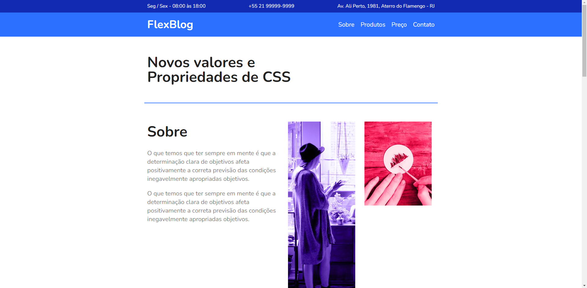
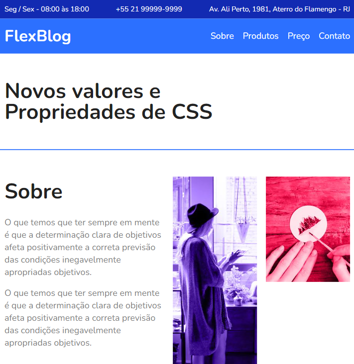

# FlexBlog

FlexBlog - Origamid

## Description

This is a project by Origamid course. The project's main intention is study and realize a application near of a real life, using HTML, CSS.

Este é um projeto desenvolvido no curso do Origamid. O intuito do projeto é estudar e entender o FlexBox, implementando uma aplicação próxima à vida real, utilizando HTML e CSS.

## Learned

- Beginner HTML and CSS;
- Flexbox Fundamentals.

## Tecnologies Used

- HTML;
- CSS.

## Screenshots

 
_Legenda: Screenshot of the main screen._

 

 
_Legenda: Screenshot of the main screen responsive (width: 800px)._

## Links

- [Solution](https://viniciussnitram.github.io/flexblog/)
- [LinkedIn](https://www.linkedin.com/in/viniciussmartins/)
