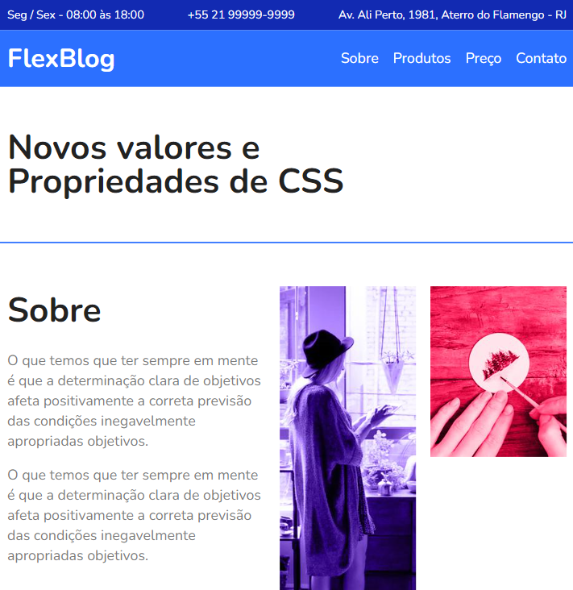

# FlexBlog

FlexBlog - Origamid

## Descrição

Este é um projeto desenvolvido no curso do Origamid. O intuito do projeto é estudar e entender o FlexBox, implementando uma aplicação próxima à vida real, utilizando HTML e CSS.

## Aprendizagem

- HTML e CSS Básico;
- Fundamentos do Flexbox.

## Tecnologias Utilizadas

- HTML;
- CSS.

## Capturas de Tela

 
_Legenda: Screenshot da tela principal._

 

 
_Legenda: Screenshot da tela principal responsiva (width: 800px)._

## Links

- [Solução](https://viniciussnitram.github.io/flexblog/)
- [LinkedIn](https://www.linkedin.com/in/viniciussmartins/)
